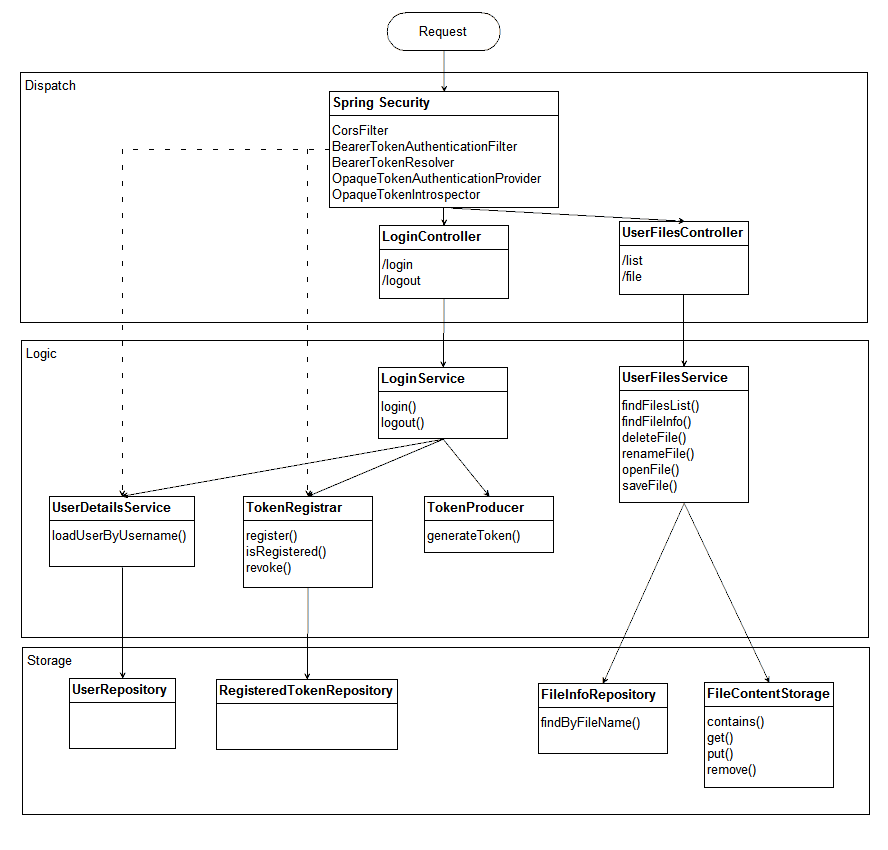

## Облачное хранилище

### Описание проекта

Проект представляет из себя REST-сервис для загрузки файлов и вывода списка уже загруженных
файлов пользователя.

Заранее подготовленное веб-приложение (FRONT) подключается к разработанному сервису через
endpoint вида [http://backend:8080](http://backend:8080).

API методы описаны в спецификации [CloudServiceSpecification.yaml](https://github.com/netology-code/jd-homeworks/blob/master/diploma/CloudServiceSpecification.yaml)

#### Схема работы полного приложения


* Клиент получает статичный контент веб-приложения от HTTP-сервера nginx в контейнере **cloudservice-front**.
* Вызовы к **/api/** проксируются к Spring Boot REST приложению в контейнере **cloudservice-rest**.
* Для работы backend приложению требуется база данных. Используется PostgreSQL в контейнере
  **cloudservice-dbserver**. Файлы базы данных отображаются в каталог **/appdata/db-data/**
* Метаданные пользовательских файлов хранятся в БД. При операции **удаления** помечаются как скрытые.
* Содержимое хранится в каталоге **/appdata/userfiles/** в виде файлов с идентификаторами UUID.
  Отсутствие коллизий обеспечивается [свойствами UUID](https://ru.wikipedia.org/wiki/UUID).
* Для дополнительной проверки токенов авторизации используется подпись с помощью секретного ключа.
  Он хранится в файле **/appdata/keys/jwt-secret.dat** и представляет собой любые бинарные данные
  длиной от 256 бит.

#### Схема компонентов REST сервиса



#### Безопасность

Безопасность доступа к ресурсам обеспечивается проверкой выданных токенов (JWT+JWS).

* Неавторизованный пользователь может отправить на открытый endpoint **/login** свои логин и пароль
  в виде JSON объекта.
* Если даннные пользователя найдены в системе (UserDetailsService) то для клиента будет сгенерирован
  токен авторизации (TokenProducer).
* В последующих вызовах от клиента ожидается наличие токена в HTTP заголовке запроса `auth-token`.
* Компонент BearerTokenResolver извлекает токен из заголовка и передает дальше по цепочке.
* Компонент OpaqueTokenIntrospector выполняет вызов напрямую к сервису TokenRegistrar чтобы
  убедиться, что токен еще разрешен. JWT токен декодируется и проверяется его подпись.
  На основе данных токена создается объект авторизации OAuth2User.
* OpaqueTokenAuthenticationProvider авторизует пользователя и заполняет SecurityContext для запроса.
* Следующие компоненты, например контроллеры и сервисы, смогут извлечь данные авторизации из контекста.

> Токеном может быть любой набор зарегистрированных данных, но JWT выбран для упрощения работы.
  Если пропадает требования проверки отзыва токена, то он может быть проверен и декодирован на месте
  любым микросервисом без обращения к серверу авторизации. JWS подпись гарантирует его целостность и
  валидность. А срок действия может быть задан в полях токена.

#### Каталог `appdata`

В процессе работы сервис использует каталог хоста `appdata`. Подкаталоги используются для работы компонентов системы.
* `db-data/` - база данных PostgresSQL. Содержит данные авторизации и метаданные файлов пользователей.
* `keys/jwt-secret.dat` - файл с данными ключа для подписи JWT. Любые бинарные данные не менее 256 бит.
* `userfiles/` - хранилище контента пользовательских файлов.

Перед первым запуском приложения рекомендуется задать новые данные для подписи. Это можно сделать
заполнив **jwt-secret.dat** текстом. Или сгенерировать, например с OpenSSL:
```shell
openssl genpkey -algorithm RSA -outform DER -out appdata/keys/jwt-secret.dat
```

### Сборка и запуск REST сервиса

Для сборки и запуска только REST-сервиса используйте команду:
```shell
docker-compose up
```
Будут созданы необходимые docker контейнеры и REST-сервис начнет отвечать по адресу [http://localhost:8080](http://localhost:8080).

### Сборка и запуск полного приложения

Для сборки и запуска полного приложения используйте команду:
```shell
docker-compose -f docker-compose-full.yaml up
```
1. Будут загружены исходные коды FRONT приложения на Vue.js и выполнена сборка с помощью Node.js.
2. Готовое FRONT приложение интегрировано с nginx и собран контейнер `cloudservice-front`.
3. REST сервис на Spring Boot будет собран в jar-файл с помощью Maven и помещен в контейнер `cloudservice-rest`.
4. Для REST сервиса будет использоваться PostgreSQL база данных в контейнере `cloudservice-dbserver`.
5. После запуска приложение будет использовать каталог хоста `appdata`.

FRONT приложение начнет отвечать по адресу [http://localhost/](http://localhost/).
Доступ к REST будет возможен через проксирование по адресу [http://localhost/api/](http://localhost/api/)

### Тестирование

В процессе сборки Spring Boot приложения будут запущены только **юнит тесты** отдельных компонентов
с помощью заглушек.

Проверить работоспособность всего приложения **интеграционными тестами** можно командой:
```shell
mvn clean verify -Pintegration
```

### Тестовые данные

В только что созданном приложении уже содержатся регистрационные записи тестовых пользователей.

|Логин  |Пароль|
| ---   | ---  |
| user1 | 123  |
| user2 | 234  |
